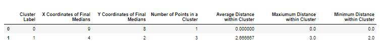

[](https://travis-ci.org/UBC-MDS/KMediansPy)


# KMediansPy

A python package for KMedians Clustering.

# About

Cluster analysis or clustering is the task of grouping a set of objects in such a way that objects in the same group (called a cluster) are more similar (in some sense or another) to each other than to those in other groups (clusters). In k-medians clustering, we partition `n` observations into `k` clusters. It calculates the median for each cluster to determine its centroid. The `KMediansPy` package performs k-medians clustering on the dataset entered by the users and returns the clustered data.. This can prove to be an extremely beneficial package as k-medians is more robust to outliers than the arithmetic mean(k-means). The objective of this package is to provide a robust clustering method to solve some of the issues related to outliers and missing data.

| **Team Members** |
| -- |
| [Sreya Guha](https://github.com/sreyaguha) |
| [Ayla Pearson](https://github.com/aylapear) |
| [Fan Nie](https://github.com/Jamienie)  |
| [Ting Pan](https://github.com/panntingg) |


# Functions included

The three functions in the package are :

1. `distance` function

      - Calculates the Manhattan distance between the medians and every point in the dataset

2. `KMedians` function

      - Groups the points in your dataset ,X, into the desired number of clusters, based on the median distance between the points.
    This function uses random intilization to assign the first medians and then will update the medians and
    the group assignments until the assignment does not change.

3. `summary` function

      - Generates the descriptive statistics that summarize the implementation of the `KMedians` function on the input data. It returns a dataframe that contains information about the model run such as the number of clusters, the number of points in each cluster, the X and Y coordinates of the final medians, the average distance within a cluster, the maximum distance within a cluster and the minimum within the cluster. 


# Usage Scenario

k-median is more robust to noise and outliers as compared to k-means. Let's look at an example, suppose we want to cluster on one dimension with k=2. One cluster has most of its members around 1000 and the other around -1000; but there is an outlier (or noise) at 100000. It obviously belongs to the cluster around 1000 but k-means will put the center point away from 1000 and towards 100000. This may even make some of the members of the 1000 cluster (say a member with value 500) to be assigned to the -1000 cluster. k-median will select one of the members around 1000 as the median, it'll probably select one that is bigger than 1000, but it will not select an outlier.
Thus we would want to use

# Installation

```bash
pip install git+https://github.com/UBC-MDS/KMediansPy.git

```

# Usage

```
>> from KMediansPy.distance import distance
>> from KMediansPy.KMedians import KMedians
>> from KMediansPy.summary import summary

>> X = np.array([[1, 2],[5, 4]])
>> medians = np.array([[1, 2],[5, 4]])
>> dist = distance(X, medians)
>> print(dist)
>> [[0 6]
 [6 0]]

>> X = np.array([[1, 2],[5, 4],[9, 8]])
>> k = 2
>> KMedians(X, 2)
>> [[3 3]
 [9 8]]
>> [0 0 1]

>> X = np.array([[1, 2],[5, 4]])
>> med = np.array([[1, 2]])
>> labels = [0, 0]
>> y = summary(X, med, labels )
>> print(y)                              
 ```



# Run tests

From root directory, run all test files in terminal:

```
python -m pytest
```

